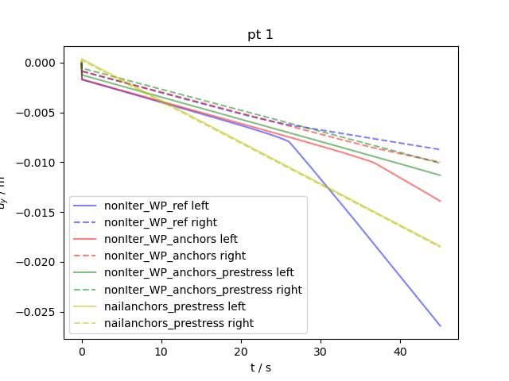

+++
author = "Jörg Buchwald, Mehran Ghasabeh, Thomas Nagel"
weight = 114
project = ["Mechanics/SlopeStabilityAnchors/fault_slip_SD_noniterWP_anchors_prestress.xml"]
date = "2025-07-11T14:39:39+01:00"
title = "Slope stabilized by anchors"
image = "output_10_0.png"
+++



## Problem description

### Slope stabilized by anchors

The problem consists of a rectangular 20m x 20m model domain divided by a weakness plane.
The weakness plane is described by a separate material behavior and divides the two sides between 5.30197m and 5.37187m at the lower boundary and between 14.6281m and 14.698m at the top boundary.
While the right part is fixed at the bottom and the right side, the left part is only controlled by Neumann traction forces, i.e. 0 Pa at the bottom, 6 MPa from the left and and 7 MPa from the top. Additional 3.3 MPa initial stress are set along z-direction.
The slipping of the slope is caused by increasing the stress linearly at the top from 7 MPa to 100 Mpa at t=1000 s.

| Material properties  | Elastic Medium   | Fault Medium               |
| :------------------- | :--------------: | -------------------------: |
| $\rho$               | 2450 kg / m$^3$  | 2450 kg / m$^3$            |
| E                    | 6.1065 GPa       | 0.281 GPa                  |
| $\nu$                | 0.3275           | -0.5                       |
| cohesion             | 850e13 Pa        | 850e10 Pa                  |
| plane cohesion       | 850e10 Pa        | 0 Pa                       |
| plane friction angle | 22               | 22                         |
| plane dilatancy angle| 10               | 10                         |
| friction angle       | 22               | 22                         |
| dilatancy angle      | 0                | 0                          |
| transition angle     | 29               | 29                         |
| tension cutoff       | 1                | 1                          |

This slip can be prevented by fixing the left part using one-dimesional anchor elements to the fixed side.
The entire model has XXX triangular elements


Anchor elements can be defined in JSON files by giving the start and end points and setting their properties:

```json
{
    "anchor_start_points": [
        [
            1,
            18,
            0
        ],
        [
            1,
            14,
            0
        ],
        [
            1,
            9,
            0
        ],
        [
            1,
            4.5,
            0
        ]

    ],
    "anchor_end_points": [
        [
            16.4,
            18.0,
            0
        ],
        [
            14.4,
            14.0,
            0
        ],
        [
            12.4,
            9.0,
            0
        ],
        [
            10.4,
            4.5,
            0
        ]


    ],
    "maximum_anchor_stress": [500e26, 500e26, 500e26, 500e26],
    "initial_anchor_stress": [5e7, 5e7, 5e7, 5e7],
    "residual_anchor_stress": [250e6, 250e6, 250e6, 250e6],
    "anchor_radius": [0.2, 0.2, 0.2, 0.2],
    "anchor_stiffness": [100e9, 100e9, 100e9, 100e9],
    "free_fraction": [0.0, 0.0, 0.0, 0.0]
}
```

The maximum anchor stress is the stress until the anchor behaves elastically. Above corresponding strain it jumps back to the constant resudual anchor stress.
The initial anchor stress can be used to set a prestress condition. Radius and stiffness are used to calculate the spring constant.
The free fraction the size of the anchor grouting element. I.e. a value of 0 corresponds to a nail-type whereas a value of one is a point-to-point anchor.
This JSON file can be converted into an Anchor VTU file which can be read in as every other boundary or source term mesh file:

```bash
CreateAnchors -f four_anchors.json -i geo_domain_2D_q8.vtu -o four_anchors_prestress.vtu -l all --max-iter 60 --tolerance 1e-13
```

The actual Anchors are the activated by the corresponding source term type:

```xml
<source_terms>
    <source_term>
        <mesh>four_anchors_prestress</mesh>
        <type>EmbeddedAnchor</type>
        <external_anchor_head_load>force0</external_anchor_head_load>
    </source_term>
</source_terms>
```

The parameter defined by external anchor head load allows to provide an additional load on the anchor head.
The following plot shows the difference in the displacement of the left (11,15,0) and the right (13,15,0) side without anchors, with relaxed and prestressed anchors.


